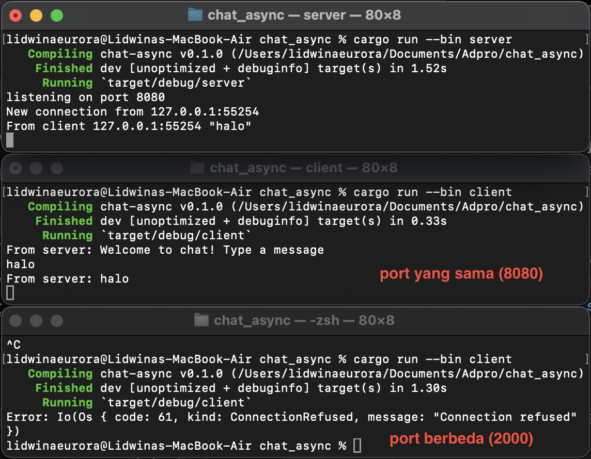
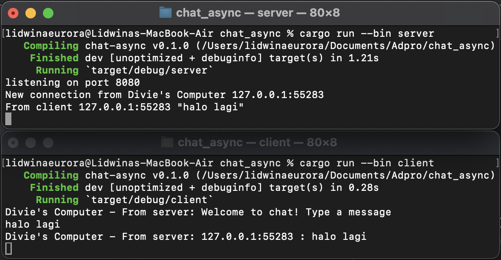

# Advance Programming Tutorial 10
Tutorial for Advanced Programming 2024 Module 10 - Faculty of Computer Science, Universitas Indonesia

---
## Reflection - Broadcast Asynchronous Chat

---

### 2.1. Original code of broadcast chat.

Ketika server di-run, setiap client yang di-run akan terhubung ke server menggunakan WebSocket. Dapat terlihat dari gambar di atas, bahwa ketika pengguna mengirimkan pesan dari salah satu client, pesan tersebut akan dikirim ke server dan ke semua client yang terhubung ke server tersebut.

Sehingga, untuk setiap pesan yang dikirimkan oleh client, client lain akan melihat tampilan pesan tersebut. Ini berbentuk seperti chatroom dimana pesan dikirim oleh salah satu client dan dapat dilihat oleh client lainnya secara real-time. Pengiriman pesan real-time dapat terjadi karena WebSocket memungkinkan komunikasi server-client secara instan tanpa perlu menunggu response server. 

### 2.2. Modifying the websocket port

Seperti yang sudah dikatakan pada tutorial bahwa koneksi artinya 2 sisi, baik client maupun server, jika ada modifikasi maka modifikasi tersebut perlu dilakukan di kedua sisi. Dalam hal ini adalah mengganti port menjadi `8080` di bagian server.rs yakni `TcpListener::bind("127.0.0.1:8080").await?` dan client.rs yakni `ws://127.0.0.1:2000`. Dengan mengubah port di kedua sisi client dan server, dapat dipastikan koneksi antara client dan server akan berjalan dengan lancar tanpa gangguan.

Server dan client pun menggunakan protocol yang sama yaitu WebSocket diimplementasikan dalam library `tokio_websockets` untuk mendukung komunikasi real-time. Pada server.rs didefinisikan dengan `WebSocketStream` dan `ServerBuilder` sedangkan pada client.rs didefinisikan dengan `ClientBuilder` dan `WebSocketStream`.

### 2.3. Small changes. Add some information to client

Untuk mengakomodasi informasi IP dan Port dari sender, ada beberapa perubahan yang saya lakukan pada code. Berikut diantaranya:

- Mengubah broadcast text send menjadi `bcast_tx.send(format!("{addr} : {text}"))?;`. Untuk memasukkan informasi IP dan Port dari sender ke dalam pesan. 
- Menambahkan nama sender pada server.rs pada bagian `New connection from Divie's Computer {addr:?}`. Untuk memberikan informasi yang lebih lengkap tentang koneksi yang terjadi dari komputer milik sender.
- Menambahkan nama sender pada client.rs pada bagian `Divie's Computer - From server: {}", text`. Untuk mengetahui asal pesan dan pengidentifikasian sumber pesan yakni dari komputer milik sender.
