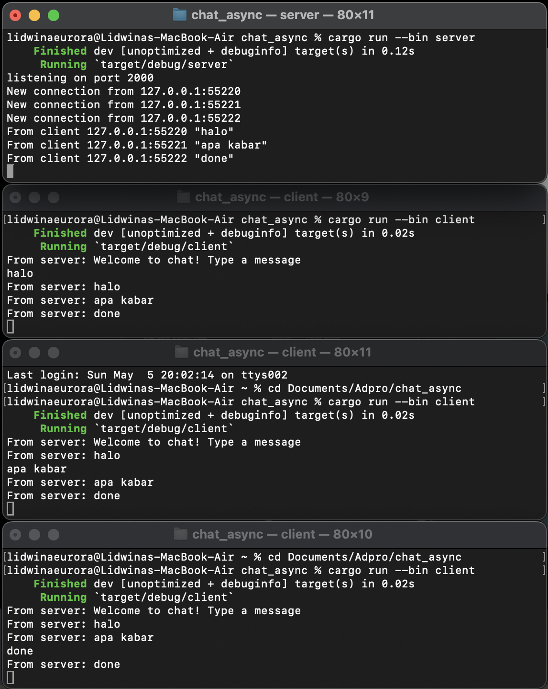

# Advance Programming Tutorial 10
Tutorial for Advanced Programming 2024 Module 10 - Faculty of Computer Science, Universitas Indonesia

---
## Reflection - Broadcast Asynchronous Chat

---

### 2.1. Original code of broadcast chat.

Ketika server di-run, setiap client yang di-run akan terhubung ke server menggunakan WebSocket. Dapat terlihat dari gambar di atas, bahwa ketika pengguna mengirimkan pesan dari salah satu client, pesan tersebut akan dikirim ke server dan ke semua client yang terhubung ke server tersebut.

Sehingga, untuk setiap pesan yang dikirimkan oleh client, client lain akan melihat tampilan pesan tersebut. Ini berbentuk seperti chatroom dimana pesan dikirim oleh salah satu client dan dapat dilihat oleh client lainnya secara real-time. Pengiriman pesan real-time dapat terjadi karena WebSocket memungkinkan komunikasi server-client secara instan tanpa perlu menunggu response server. 